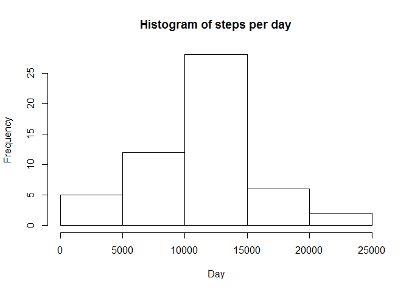
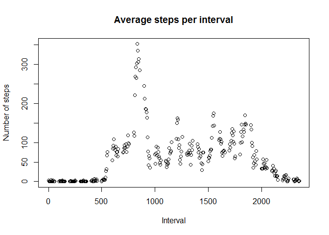
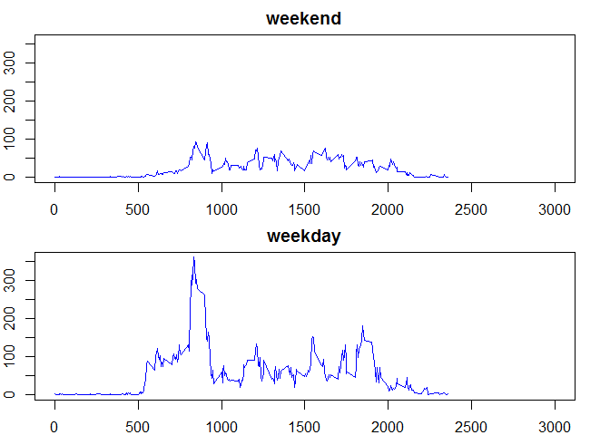

# Reproducible Research: Peer Assessment 1


## Loading and preprocessing the data


```r
library(dplyr)
```

```
## Warning: package 'dplyr' was built under R version 3.2.1
```

```
## 
## Attaching package: 'dplyr'
## 
## The following objects are masked from 'package:stats':
## 
##     filter, lag
## 
## The following objects are masked from 'package:base':
## 
##     intersect, setdiff, setequal, union
```

```r
activity <- read.csv("C:/Users/Luke/Coursera/activity.csv")
activity$date <- as.Date(activity$date, "%Y-%m-%d")
```

## What is mean total number of steps taken per day?


```r
by_date <- group_by(activity, date)
per_day <- summarise(by_date, steps_per_day = sum(steps))
hist(per_day$steps_per_day, xlab = "Day", ylab = "Frequency", main = "Histogram of steps per day")
```

 

```r
mean(per_day$steps_per_day, na.rm = TRUE)
```

```
## [1] 10766.19
```

```r
median(per_day$steps_per_day, na.rm = TRUE)
```

```
## [1] 10765
```

## What is the average daily activity pattern?


```r
by_interval <- na.omit(group_by(activity, interval))
per_interval <- summarise(by_interval, steps_per_interval = sum(steps) / 31)
plot.ts(per_interval$interval, per_interval$steps_per_interval, xlab = "Interval", ylab = "Number of steps", main = "Average steps per interval")
```

 

```r
max(per_interval$steps_per_interval)
```

```
## [1] 352.4839
```

```r
per_interval[which(per_interval$steps_per_interval > 350),]
```

```
## Source: local data frame [1 x 2]
## 
##   interval steps_per_interval
## 1      835           352.4839
```


## Imputing missing values


```r
activityraw <- read.csv("C:/Users/Luke/Coursera/activity.csv")
activityraw$date <- as.Date(activity$date, "%Y-%m-%d")

length(which(is.na(activityraw$steps) == TRUE))
```

```
## [1] 2304
```

```r
replace_na <- function() {
        
        intervalcounter <- integer()
        intervalcounter <- 0
        
        for (i in 1:length(activity$steps)) {
                if (is.na(activity$steps[i]) == TRUE){
                        intervalcounter <- activity$interval[i]
                        activity$steps[i] <- per_interval$steps_per_interval[which(per_interval$interval == intervalcounter)]
                }
                
        }
        activity <- activity
        return(activity)
}
activity <- replace_na()

mean(activity$steps)
```

```
## [1] 40.86189
```

```r
median(activity$steps)
```

```
## [1] 0
```


## Are there differences in activity patterns between weekdays and weekends?


```r
activity_by_weekday <- mutate(activity, day = weekdays(activity$date))
activity_by_weekday <- mutate(activity_by_weekday, daytype = "weekday")
activity_by_weekday$daytype[activity_by_weekday$day == "Saturday" | activity_by_weekday$day == "Sunday"] <- "weekend"

weekdays_steps <- activity_by_weekday[which(activity_by_weekday$daytype == "weekday"),]
weekends_steps <- activity_by_weekday[which(activity_by_weekday$daytype == "weekend"),]

by_interval_weekday <- group_by(weekdays_steps, interval)
per_interval_weekday <- summarise(by_interval_weekday, steps_per_interval = sum(steps) / 31)


by_interval_weekend <- group_by(weekends_steps, interval)
per_interval_weekend <- summarise(by_interval_weekend, steps_per_interval = sum(steps) / 31)


par(mfrow = c(2,1))
par(mar = rep(2, 4))
plot.ts(per_interval_weekend$interval, per_interval_weekend$steps_per_interval, xy.lines = TRUE, type = "n", main = "weekend", ylim = c(0,360), xlim = c(0, 3000), lwd = 1, col = "blue", xlab = "Interval", ylab = "Number of steps")
plot.ts(per_interval_weekday$interval, per_interval_weekday$steps_per_interval, xy.lines = TRUE, type = "n", main = "weekday", ylim = c(0,360), xlim = c(0, 3000), lwd = 1, col = "blue", xlab = "Interval", ylab = "Number of steps")
```

 

